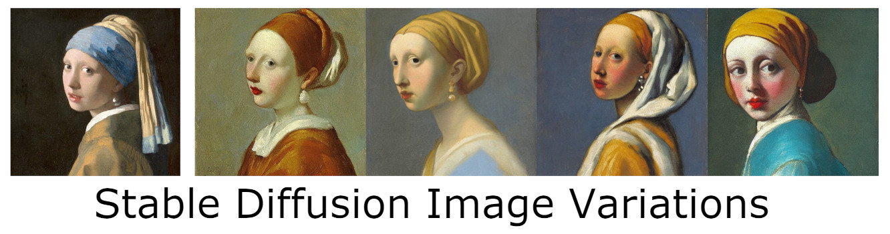
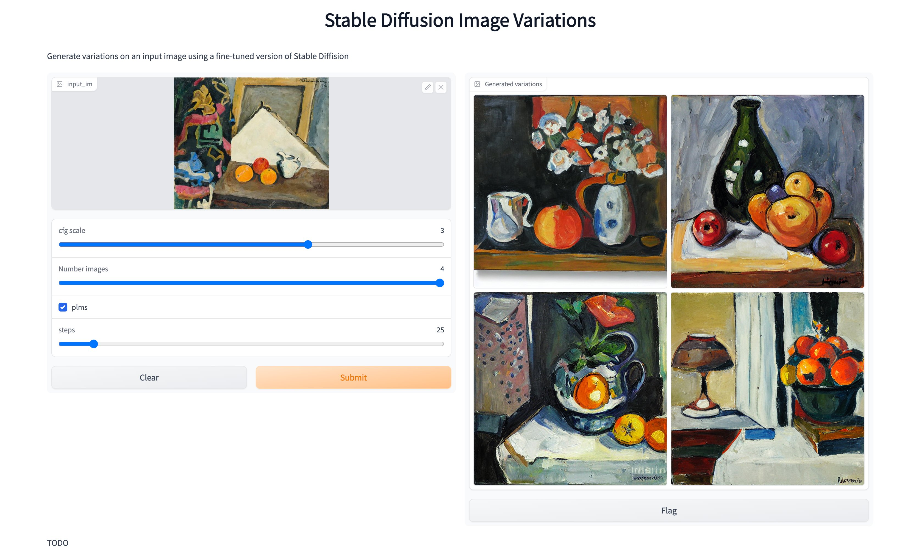

# Experiments with Stable Diffusion

This repository extends and adds to the [original training repo](https://github.com/pesser/stable-diffusion) for Stable Diffusion. Be careful using this repo, it's by personal Stable Diffusion playground and backwards compatibility breaking changes might happen anytime. So use at your own risk. I recommend sticking to a particular git commit if you are depending on some functionality.

Currently it adds:

- [Image Mixer](#image-mixer)
- [Super Resolution](#super-resolution)
- [Imagic](notebooks/imagic.ipynb)
- [Fine tuning](#fine-tuning)
- [Image variations](#image-variations)
- [Conversion to Huggingface Diffusers](scripts/convert_sd_to_diffusers.py)

## Image Mixer


The model is available on [huggingface spaces](https://huggingface.co/spaces/lambdalabs/image-mixer-demo) or to run locally do the following:

```bash
git clone https://github.com/justinpinkney/stable-diffusion.git
cd stable-diffusion
git checkout 1c8a598f312e54f614d1b9675db0e66382f7e23c
python -m venv .venv --prompt sd
. .venv/bin/activate
pip install -U pip
pip install -r requirements.txt
python scripts/gradio_image_mixer.py
```

Then navigate to the gradio demo link printed in the terminal.

For details on how to use the model outside the app refer to the [`run` function](https://github.com/justinpinkney/stable-diffusion/blob/c1963a36a4f8ce23784c8247fa1af0e34e02b766/scripts/gradio_image_mixer.py#L79) in `gradio_image_mixer.py`

## Super Resolution

I fine tuned a version of Stable Diffusion 1.4 for the task of super-resolution, you can find the [trained model on huggingface hub](https://huggingface.co/lambdalabs/stable-diffusion-super-res) and can run a gradio demo as follows:

```bash
git clone https://github.com/justinpinkney/stable-diffusion.git
cd stable-diffusion
python -m venv .venv --prompt sd
. .venv/bin/activate
pip install -U pip
pip install -r requirements.txt
python scripts/gradio_superres.py
```

Note since I trained this model there is now an 'official' super res model for Stable Diffusion 2 which you might prefer to use.

## Fine tuning

Makes it easy to fine tune Stable Diffusion on your own dataset. For example generating new Pokemon from text!

[](https://replicate.com/lambdal/text-to-pokemon)
[](https://colab.research.google.com/github/LambdaLabsML/lambda-diffusers/blob/main/notebooks/pokemon_demo.ipynb)
[](https://huggingface.co/spaces/lambdalabs/text-to-pokemon)


> Girl with a pearl earring, Cute Obama creature, Donald Trump, Boris Johnson, Totoro, Hello Kitty


For a step by step guide see the [Lambda Labs examples repo](https://github.com/LambdaLabsML/examples).

## Image variations



[](https://47725.gradio.app/)
[](https://colab.research.google.com/drive/1JqNbI_kDq_Gth2MIYdsphgNgyGIJxBgB?usp=sharing)
[](https://huggingface.co/spaces/lambdalabs/stable-diffusion-image-variations)

For more details on the Image Variation model see the [model card](https://huggingface.co/lambdalabs/stable-diffusion-image-conditioned).

- Get access to a Linux machine with a decent NVIDIA GPU (e.g. on [Lambda GPU Cloud](https://lambdalabs.com/service/gpu-cloud))
- Clone this repo
- Make sure PyTorch is installed and then install other requirements: `pip install -r requirements.txt`
- Get model from huggingface hub [lambdalabs/stable-diffusion-image-conditioned](https://huggingface.co/lambdalabs/stable-diffusion-image-conditioned/blob/main/sd-clip-vit-l14-img-embed_ema_only.ckpt)
- Put model in `models/ldm/stable-diffusion-v1/sd-clip-vit-l14-img-embed_ema_only.ckpt`
- Run `scripts/image_variations.py` or `scripts/gradio_variations.py`

All together:
```
git clone https://github.com/justinpinkney/stable-diffusion.git
cd stable-diffusion
mkdir -p models/ldm/stable-diffusion-v1
wget https://huggingface.co/lambdalabs/stable-diffusion-image-conditioned/resolve/main/sd-clip-vit-l14-img-embed_ema_only.ckpt -O models/ldm/stable-diffusion-v1/sd-clip-vit-l14-img-embed_ema_only.ckpt
pip install -r requirements.txt
python scripts/gradio_variations.py
```

Then you should see this:

[](https://twitter.com/Buntworthy/status/1565704770056294400)

Trained by [Justin Pinkney](https://www.justinpinkney.com) ([@Buntworthy](https://twitter.com/Buntworthy)) at [Lambda](https://lambdalabs.com/)
